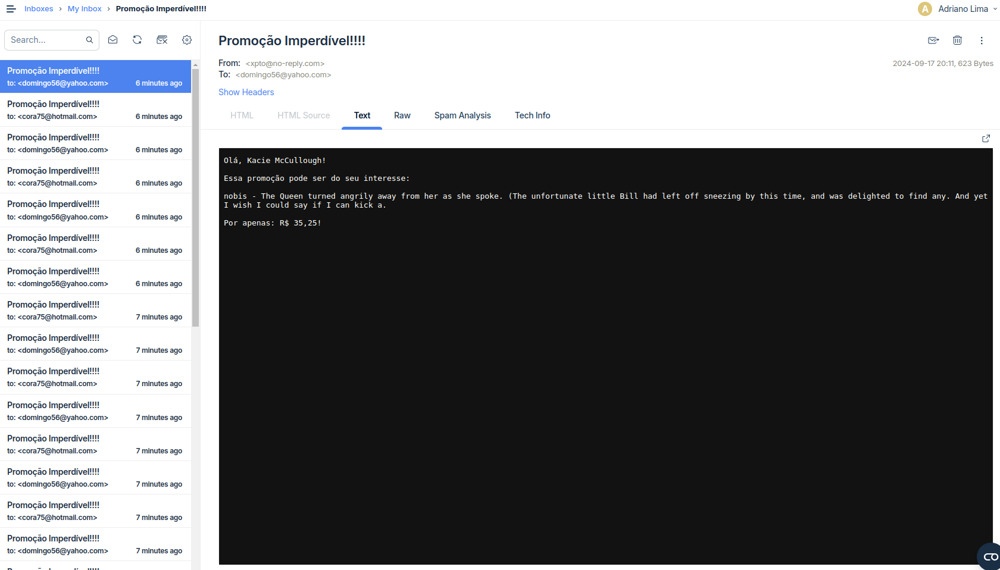

# Job de Envio de Promoções Para Clintes 

Este projeto é um job desenvolvido com Spring Batch para envios de promoções para clientes.
O projeto foi desenvolvido durante o curso [Curso para Desenvolvimento de Jobs com Spring Batch](https://www.udemy.com/course/curso-para-desenvolvimento-de-jobs-com-spring-batch/) na Udemy.

## Configuração do Ambiente

### Pré-requisitos

- Docker
- Maven
- Java 17

### Configuração do Banco de Dados

O projeto utiliza Docker para executar dois bancos de dados MySQL. Certifique-se de ter Docker instalado e funcionando corretamente.

#### Banco de Dados `spring_batch`

```properties
spring.datasource.jdbcUrl=jdbc:mysql://localhost:3306/spring_batch
spring.datasource.username=user
spring.datasource.password=123456
```

#### Banco de Dados `fatura_cartao_credito`

```properties
app.datasource.jdbcUrl=jdbc:mysql://localhost:3307/fatura_cartao_credito
app.datasource.username=user
app.datasource.password=123456
```

### Configuração de Email
A configuração do servidor SMTP é feita usando o [Mailtrap](https://mailtrap.io) para testes.
```properties
spring.mail.host=sandbox.smtp.mailtrap.io
spring.mail.port=2525
spring.mail.username=
spring.mail.password=
spring.mail.properties.mail.smtp.auth=true
spring.mail.properties.mail.smtp.starttls.enable=true
```

### Inicialização do Banco de Dados

Para iniciar os bancos de dados MySQL usando Docker:

```bash
docker-compose up -d
```

### Execução do Projeto

Para compilar e executar o projeto, use o Maven:

```bash
mvn clean install
java -jar target/fatura-cartao-credito-job-1.0-SNAPSHOT.jar
```

### Visualização no Email

